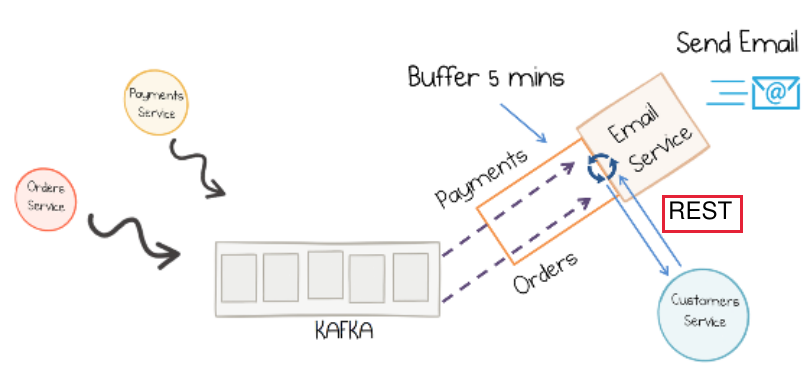
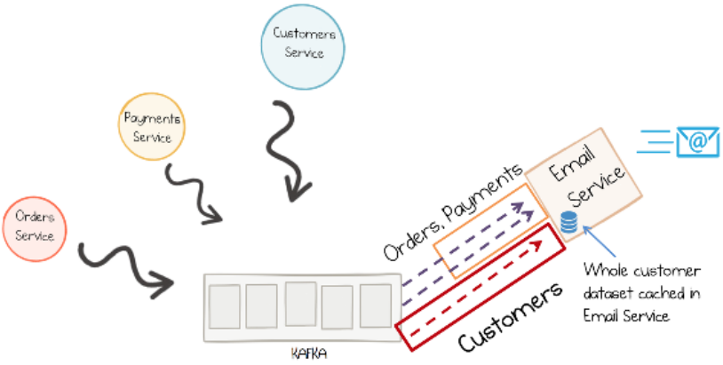
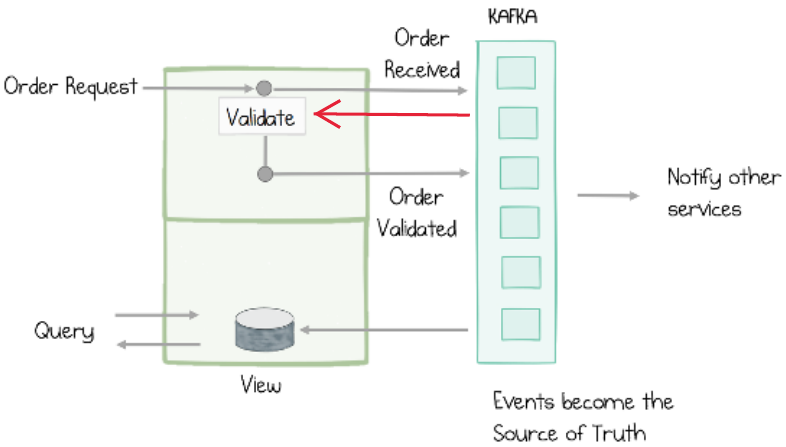

# Architecture in microservices with Kafka Stream

Project was created based on https://github.com/confluentinc/kafka-streams-examples and contains awesome ideas behind designing-event-driven-systems book
(https://www.confluent.io/designing-event-driven-systems/)

 

## Ideas behind project
* 2 Hats od events:
   * events for notifications
     

    * events to provide state transfer
      
      

* Event sourcing:
  * Every state change in a system is recorded (like a git).
    
    '+' avoid object-relational mismatch
    
    '+' provide history of changes
    
    '+' efficient use exactly one delivery
    
    

* CQRS
  * Separete the write path from read path
    
    
    Events can be sent via kafka connectors to external sink etc. Mongo or Elasticsearch Service (https://docs.confluent.io/home/connect/self-managed/kafka_connectors.html).
    Thanks to it, we are able to read from anything we would like to.
    In CQRS single write model can push data into many read models.
    

* Handling errors during processing events
    * DLQ
    * Retries topics
    * Handling poison pills
    * Handling unexpected errors
    

* Write ahead:
    * write input data ASAP - without redundant operations (similar approaches in DB)

* Sharing Data across services via events
